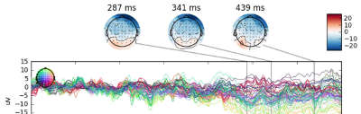
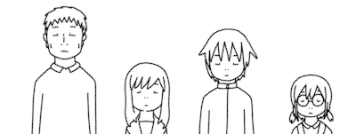
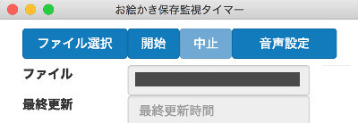

<head>
<title>ニンジャのゆるふわ修練場</title>
<link href="nin.css" rel="stylesheet"></link>
</head>

[↑](#top){.bottombutton .menu .normal-fg}

## ニンジャのゆるふわ修練場 {.containerlabel}
::: {.anc #top}
:::

::: Mokuji
[同人活動](#doujin){.menu .normal-fg}
[MNE同人誌](#doujin){.menu .normal-fg}
[学園ニンジャ](#ninja){.menu .normal-fg}
[お絵かきタイマー](#timer){.menu .normal-fg}
[プリティモモ](#momo){.menu .danger-fg}
[pdf2pptx](#pdf2pptx){.menu .normal-fg}
[ninja-biboo](#biboo){.menu .normal-fg}
[About](#about){.menu .normal-fg}
:::

::: {.clear}
:::

# 同人活動
:::::: {.container}
::: {.anc #doujin}
:::
## MNE同人誌 {.containerlabel}
{width=100% .nosave}
脳波・脳磁図解析用の  
pythonのパッケージの  
MNEpythonの入門同人誌です。  
まだ書いている途中です…。  
正しいこと書いてる保証はない。  
[ダウンロード](https://github.com/uesseu/MNE-Doujinshi/raw/master/out.pdf){.button .normal-fg}
[リポジトリ](https://github.com/uesseu/MNE-Doujinshi){.button .normal-fg}
::::::

:::::: {.container}
::: {.anc #ninja}
:::
## 学園ニンジャ {.containerlabel}
{width=100% .nosave}
ラブコメの4コマ漫画です。  
だいたい100頁位あります。  
ちょい暗めです。  
[学園ニンジャ(pixiv)](https://www.pixiv.net/user/15182417/series/6498){.button .normal-fg}
::::::

:::::: {.container}
::: {.anc #timer}
:::
## お絵かきタイマー {.containerlabel}
{width=100% .nosave}
お絵かきの、保存し忘れを  
防ぐためのタイマー。  
音声ファイルは自分で用意してね！  
現在公開一時停止中。
::::::

:::::: {.container}
::: {.anc #momo}
:::
## プリティ☆モモ {.containerlabel .danger-fg .danger-bg}
{width=100% .nosave}
女の子が男の子を殺す  
逆リョナ漫画です。  
内容はあまりない。  
R18G。子供はみちゃダメ。  
大人も自己責任で。  
[プリティ☆モモ(pixiv、R18G)](https://www.pixiv.net/member_illust.php?mode=medium&illust_id=63254378){.button .danger-fg}
::::::

:::::: {.container}
::: {.anc #pdf2pptx}
:::
## pdf2pptx {.containerlabel}
pdfを忠実にpptxにする為の  
pythonスクリプト。  
他のサービスとかと違って  
デザインは絶対に崩れない。  
何故かって？  
内部的にスクショを撮ってる  
だけだから!  
[リポジトリ](https://github.com/uesseu/pdf2pptx){.button .normal-fg}
::::::

:::::: {.container}
::: {.anc #biboo}
:::
## Biboo {.containerlabel}
bibtexのファイルを使って  
論文の参考文献リストを  
作るやつ。  
[biboo](./biboo/index.html){.button .normal-fg}
::::::

:::{.clear}
:::
# About
:::::: {.container}

::: {.anc #about}
:::
## ここはなに？ {.containerlabel}
色んなことをする所。  
主に… 脳の生理学  
同人活動(漫画)  
プログラミング(下手)  
将棋(アマ2段のヘボ) 等の、  
成果物でもうｐできればいいな。  

## お前誰？ {.containerlabel}
別に誰でも良いじゃんヽ(´ー｀)ノ  
[qiita](http://qiita.com/uesseu){.button .normal-fg}
[github](http://github.com/uesseu){.button .normal-fg}
::::::
